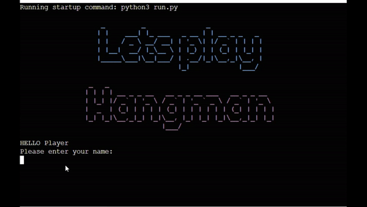
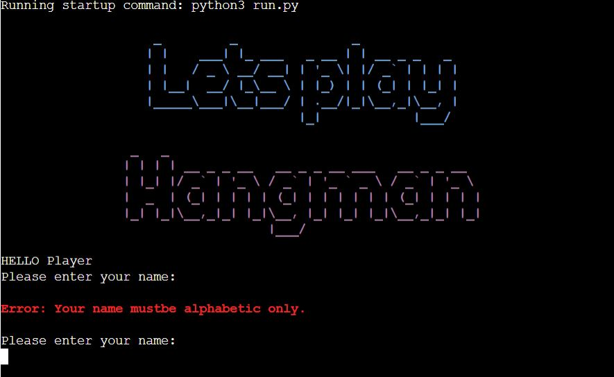
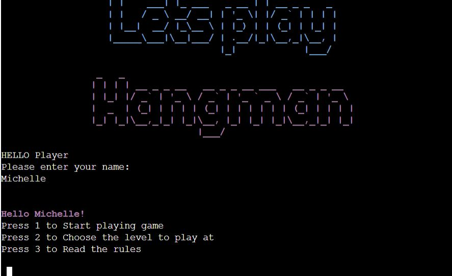
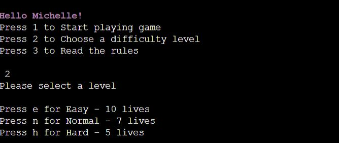
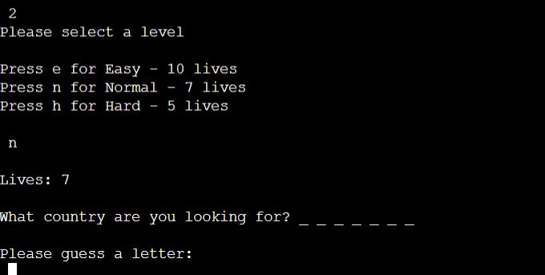
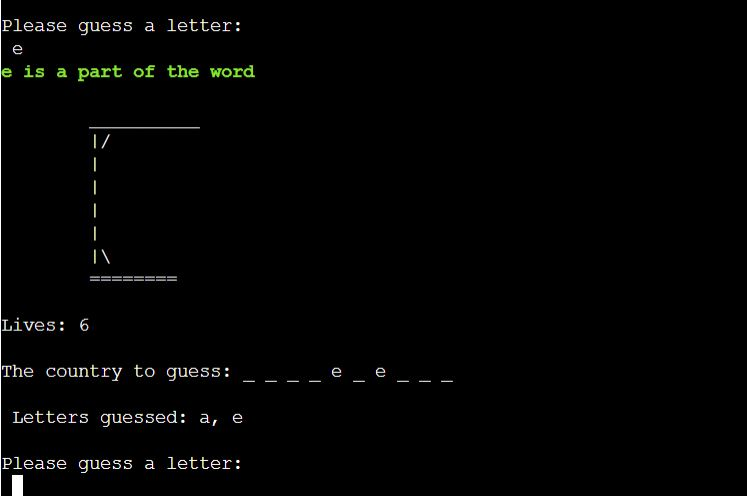
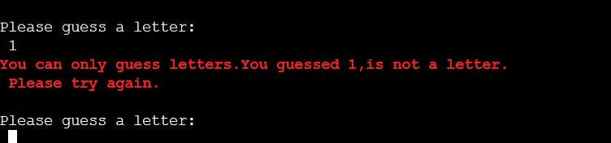
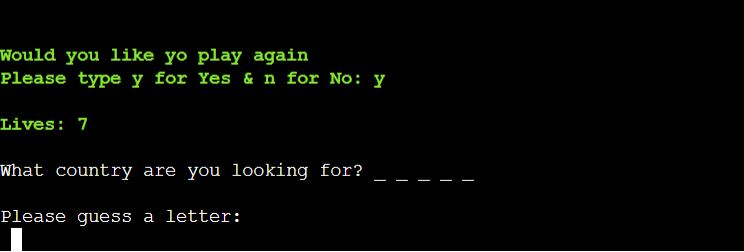
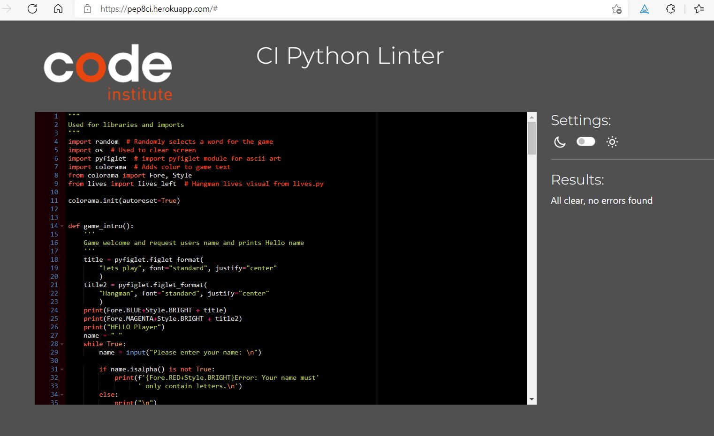

# World countries hangman game

## Table of Content
1. [Project overview](#project-overview)
2. [How to Play](#how-to-play)
3. [User Experience](#user-experience)
    1. [Target Audience](#target-audience)
    2. [User stories](#user-stories)
4. [Planning](#planning)
    1. [Logic workflow](#logic-workflow)
    2. [Aesthetic Design](#aesthetic-design)
5. [Features](#features)
6. [Testing](#testing)
    1. [Validation](#validation)
    	1. [pep8ci](#pep8ci)
    2. [Testing user stories](#testing-user-stories)
    3. [Further testing](#further-testing)
    4. [Bugs](#bugs)
7. [Deployment](#deployment)
8. [Libraries and Technologies Used](#libraries-and-technologies-used)
9. [Credits](#credits)
10. [Acknowledgements](#acknowledgements)

## Project overview
Project 3 for Code Institute Full-stack development program: Python Essentials.

View the [Live site](https://world-countries-hangman.herokuapp.com/)

The theme for this Hangman game is Countries of the World.

Hangman is an age-old guessing game, traditionally played as a paper and pencil game for two or more players but easily adaptable to an electronic game for one plater. Players can try to guess the word by inputting letters until they either guess the word or it is game over. Players can play the game on three difficulties. Either Easy with 10 lives, Normal with 7 lives, and Hard with 5 lives. 

## How to Play
In this Hangman game players aim to guess the hidden name of a country. The country is represented by a series of dashes, each representing one letter in the country name. 

The player inputs a letter into the terminal:
* If the letter appears in the country name the corresponding dash will be replaced with the letter.
* If the letter does not appear they will lose a life. 

Players continue to enter letters until they correctly guess the country name or until they have exhausted all their lives.

## User experience
### Target Audience

Anyone who want to play an online command-line interface game for a fun challenge.

### User stories
Users
1.	I want to be able to choose the level
2.	I want to play a fun and challenging game
3.	I want a visual aid to see how many lives I have left
4.	I want to read the rules of the game and understand how to play the game 
5.	I want to get a notification when the game is over 
6.	I want to have the choice to play the game again or to exit the game

Site owner

7.	I want users to be able to easily navigate the game

## Planning
### Logic workflow
During the planning process I thought about the basic steps needed to play a game of hangman,  I drew a workflow to help guide the coding process whilst developing the game. The flow chart is rough and it was a starting point for me, more consideration appears as I practically worked through the coding process.

Areas I considered before beginning the coding:

*   Where to use inputs & check inputs
*   Where to give user feed back
*   Where to give choices and direct of game from those choices

### Aesthetic Design
*   Font

Pyfiglet was installed and import pyfiglet was used to generate ASCII art for the game. Pyfiglet was added to requirements.txt then for deployment to Heroku.

The ASCII art was chosen for readability for the user from [Figlet](http://www.figlet.org/)

Standard Font - for clarity and line spacing. Used on Title & Winner and Game Over Message

*   Colour

Colorama was installed and imported to change the font colour. Colorama was added to requirements.txt then for deployment.

A mix of magenta, blue were used on the introduction and rules area,  green and red was used as a visual cue to users for certain feedback.

## Features 
### Game introduction screen

The user is presented with a simple welcome screen when they open the application that tells them what the game is. It has four different compoments:
1. Game title
2. Welcome note
3. User name request and 
4. Input Space for the users name.

*   The user is asked to enter their name before they can play the game. 
*   The game is designed to require an input of letters at this point, if the user enters anything other than letters they will get an error message. 

Once the user enters their name correctly, they will be welcomed and presented with a game menu:
*   They can select to play the game
*   They can set a difficulty level
*   They can read the rules of the game

The game is designed to require an input of numbers at this point, if the user enters anything other than 1, 2 or 3 they will get an error message.

INSERT ERROR

### Press 1: Start playing
If the user presses 1 the game will start, the difficulty level will default to the easy level.

Find out more in the [Input of guess by player](#input-of-guess-by-player) section

### Press 2: Set difficulty
If the user presses 2 they will be asked to select a level to play at:
*   Press e for Easy = 10 lives
*   Press n for Normal = 7 lives
*   Press h for Hard = 5 lives

*   The game is designed to require an input of letters at this point, if the user enters anything other than e, n or h they will get an error message.

INSERT IMAGES

*   Once the user makes a selection, they will be brought straight to the game at that level.
*   The number of lives will display, and the user will be asked to guess a letter

### Press 3 - Rules of the game

*   If the user presses 3 they will be shown the rules of the game.
*   The rules are laid out in simple plain English
*   The user is then asked to press enter to return to the main menu. This instruction is in a different colour to make it stand out to the user. 

### Input of guess by player

*   A function generates a country name from a list and the letters in the country name are denoted by a series of dashes.
*   The user has a number of lives based on the difficulty level they chose and as they make incorrect guesses a hangman is displayed as a graphical *  representation of the lives they have lost. 

*   As the user guesses letters, a record of all letters guessed with the shown. This will help the user ensure they do not guess the same letter again. 

When a user selects a letter that is in the word, a message in green text will appear and if the user selects a letter that is not included in the word, a message in red text will appear

For all user inputs, the game runs a validation check to ensure the input is valid. 

*   Where the user guesses a letter which they have already guessed they will receive a message to tell them. 

*   Where the user guesses a number or special character they will receive a message to tell them. 

### Win game
*   When the user correctly guesses the name of the country within their number of lives, they will be presented with a message saying they won
*   The user will be asked if they want to play again

### Game Over
*   When the user is unable to guess the name of the country within their number of lives, they will be presented with a message saying game over and identifing the word the user was trying to guess.
*   The user will be asked if they want to play again

### Play again Y/N Choice

*   When the user finishes a game, they will be asked if they wish to play again.
*   If they select Y for Yes, they will be presented with a new game at the level they previously played.

*   If they select N for No, they will be presented with the welcome screen

### Future features to be implemented

*   It would be nice to include a scoreboard so that user can compare their score. This could increase the challenge for users to try and beat their previous scores.

*   The ability to guess the entire word and once word was guessed return option of playagain Y/N

## Testing

### Validation
[pep8ci](https://pep8ci.herokuapp.com/) was used for validating the python files. All python files were checked with no errors reported.

**run.py file**

**lives.py file**

### Testing

Methods such as print() as the code was created was used to check for errors. This helped check everything was behaving as expected and functions such as generating the random word for the word being generated for the game correctly.

**Manual test cases**

List of manual test cases excuted following the code being deplayed to Heroku. All [User stories](#user-stories) are covered in this list of manual tests.

| Feature            | Expected result               | Action       | Actual Result     |
|--------------------|-------------------------------|--------------|-------------------|
| Game title         | Display On Open               | N/A          | Works as expected |
| Hello message      | Display On Open               | N/A          | Works as expected |
| Name Request       | Display On Open               | N/A          | Works as expected |
| User Input Name    | User to Input Name            | Enter        | Works as expected |
| User Input number  | Not a letter or _ Message     | Enter        | Works as expected |
| Hello {NAME}       | Displays On Enter             | N/A          | Works as expected |
| Show Game Menu     | of User Name & Enter          | N/A          | Works as expected |
| Option 1           | Game to start                 | 1 & Enter    | Works as expected |
| Game Starts        | Lives Displayed               | N/A          | Works as expected |
| Game Starts        | Hidden Word Displayed         | N/A          | Works as expected |
| Game Starts        | Gues a Letter & Input         | N/A          | Works as expected |
| Option 2           | Level Menu Displayed          | 2 & Enter    | Works as expected |
| Level Menu e       | Game To Start                 | e & Enter    | Works as expected |
| Game Starts        | Lives Displayed               | N/A          | Works as expected |
| Game Starts        | Hidden Word Displayed         | N/A          | Works as expected |
| Game Starts        | Guess a Letter & Input        | N/A          | Works as expected |
| Level Menu m       | Game To Start                 | m & Enter    | Works as expected |
| Game Starts        | Lives Displayed               | N/A          | Works as expected |
| Game Starts        | Hidden Word Displayed         | N/A          | Works as expected |
| Game Starts        | Guess a Letter & Input        | N/A          | Works as expected |
| Level Menu h       | Game To Start                 | h & Enter    | Works as expected |
| Game Starts        | Lives Displayed               | N/A          | Works as expected |
| Game Starts        | Hidden Word Displayed         | N/A          | Works as expected |
| Game Starts        | Guess a Letter & Input        | N/A          | Works as expected |
| Option 3           | Game Rules Displayed          | 3 & Enter    | Works as expected |
| Game Rules         | Return to game menu           | Enter        | Works as expected |
| Guess a letter     | Input a letter of Choice      | Enter letter | Works as expected |
| During Game Play   | Hangman Visual to Build       | N/A          | Works as expected |
| During Game Play   | Letter Not in Word Message    | N/A          | Works as expected |
| During Game Play   | Letter In Word Message        | N/A          | Works as expected |
| During Game Play   | Not a letter or _ Message     | N/A          | Works as expected |
| During Game Play   | More than 1 letter Message    | N/A          | Works as expected |
| Game Play Won      | You Won & Play Again Message  | N/A          | Works as expected |
| Game Play Lost     | You Lost & Play Again Message | N/A          | Works as expected |
| Play Again Message | Option to Select Y or No      | Y / N        | Works as expected |
| Play Y Input       | Returns to Main Menu          | Y & Enter    | Works as expected |
| Play N Input       | Returns to Main Menu          | N & Enter    | Works as expected |

**Further testing**

I asked friends and family to look at the site on their devices and report any issues they came found.

### Bugs
**Bugs encountered**

Being new to python, I did have many syntax errors, indent errors, white space errors and my lines of code were to long, these were all fixed as I was coding.

Some examples of other bugs

| Bug                                                                                                        | Fix                                                                                                                                                            |
|------------------------------------------------------------------------------------------------------------|----------------------------------------------------------------------------------------------------------------------------------------------------------------|
| Encoding error   in the get random word function                                                           | After reading   https://stackoverflow.com/questions/491921/unicode-utf-8-reading-and-writing-to-files-in-python,   I updated the function with encoding="utf8" |
| When a   letter that was in the word was selected, the game finished even if all words   were not selected | Found a error in the code, I   used two different underscore symbols without realising                                                                         |

#### Unfixed Bugs
No unfixed bugs at this time

## Deployment
The site was deployed via [Heroku]( https://id.heroku.com/login), and the live link can be found here: [Hangman – World Countries](https://world-countries-hangman.herokuapp.com/) 

### Github

This project was developed utilising the [Code Institute Template]( https://github.com/Code-Institute-Org/python-essentials-template). Some of the deployment steps below are specifically required for the new CI template and may not be applicable to older versions, or different projects.

Gitpod was used to write the code and push the code to repository created in github.

The git commands I used to push the code from gitpod to github were

`git add .` - This command was used to add the file(s) to the staging area before they are committed.

`git commit -m “commit message”` - This command was used to commit changes to the local repository queue ready for the final step.

`git push` - This command was used to push all committed code to the remote repository on github.

#### Clone the repository
The steps to clone a repository are as follows:
1.	Navigate to the GitHub repository you would like to clone
2.	Click on the code drop down button
3.	Click on the HTTPS tab
4.	Copy the repository link to the clipboard
5.	Open Git Bash
6.	Change the current working directory to the one where you want the cloned directory
7.	Type git clone and then paste the URL from the clipboard 
8.	Press Enter to create your local clone.

The repository will now be cloned on your local machine for use.

### Herouku
Before deploying to Heroku pip3 freeze > requirements.txt was used to add Colorama imports for deployment

#### Setting up a new app
1. Log in to [Heroku]( https://id.heroku.com/login) 
2. Click the button labelled **New** from the dashboard in the top right corner and from the drop-down menu select **Create New App**.
3. A unique app name must be used.
4. Next, select your region, (I chose Europe as I am in Ireland).
5. Click on the **Create App** button.

#### Updating the settings 
* Click on the **Settings Tab** and scroll down to **Add Buildpack** 
* Select **python** and click **Save Changes**, then add **node.js**.
* **Note:** The Buildpacks must be in the correct order. If not click and drag them to move into the correct order.

#### Deploying the application
* Scroll to the top of the page and now choose the **Deploy** tab.
* Select **Github** as the deployment method.
* Confirm you want to connect to GitHub.
* Search for the repository name and click the connect button.

Scroll to the bottom of the deploy page and select preferred deployment type:
* Click either **Enable Automatic Deploys** for automatic deployment when you push updates to Github.
* Select the correct branch for deployment from the drop-down menu and click **Deploy Branch** for manual deployment.

## Libraries and Technologies Used
**Language used**
*   Python - The game logic was created using Python.

**Built-in Python Libraries**

* random

The random library was imported to access the built-in method of generating a random word selection from a difined list of words. The word selected is the secret words the user must gusess in the game.

*   os

The os library was imported to create a function to utilise the os.system to clear the terminal. This supports a positive user experience on game replay by clearing the previous gameplay and making the screen clearer and more structured.

**Other**

*   GitHub - Source code is hosted on GitHub.

*   Gitpod - Used to commit and push code during the development of the project.

*   Heroku - To the deploy the code to a online terminal

*   [Colorama](https://pypi.org/project/colorama/) - For adding colour to fonts.

*   [Pyfiglet](https://pypi.org/project/pyfiglet/0.7/)  - For adding ascii art.

*   Mircosoft Visio - For creating the workflow diagram

*   Movavi video editor - To create a video of the application working

*   [ezgif](http://ezgif.com/) - To create a gif

## Credits

### Code
*   [Youtube video tutorial](https://www.youtube.com/watch?v=5x6iAKdJB6U)
*   [StackOverflow](https://stackoverflow.com)
*   [101 computing](https://www.101computing.net/python-typing-text-effect/) for the clear screen code
*   [main fucntion](https://realpython.com/if-name-main-python/#:~:text=Nesting%20code%20under%20if%20__,defined%2C%20but%20no%20code%20executes) to execute code when the file runs as a script

### Other resources used
*   [gibbo101](https://github.com/gibbo101/hangman/blob/main/README.md)
*   [Krnsand](https://github.com/Krnsand/pp3-hangman)
*   [TaraHelberg](https://github.com/TaraHelberg/Hang-Hangman)

##  Acknowledgements
Special thanks to my mentor Daisy for her assistance throughout this project.